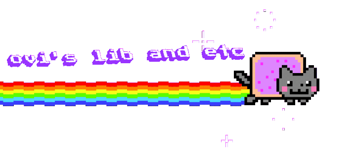

### Wassup? good? Alright then...

Here you will find all my created libraries repo link or website link or source code.

I create this repo just because you guys find my works easily.

Btw you can also discover everything by walking through my github profile and repositories!

---
### Table of Contents

1. [1/ notAcursor](#1-notacursor)
2. [ani.css](#anicss)

---

## 1/ notAcursor

A library to give your cursor cool looks in web pages.

Repo Link: [https://github.com/iamovi/notAcursor](https://github.com/iamovi/notAcursor)  
Website Link: [https://iamovi.github.io/notAcursor](https://iamovi.github.io/notAcursor)

## ani.css

Add description here.

Repo Link: [https://github.com/username/repo](https://github.com/username/repo)  
Website Link: [https://example.com](https://example.com)

## 1/ notAcurso

notAcuraor - A library to give your cursor cool looks in web pages.

Repo Link: [https://github.com/iamovi/notAcursor](https://github.com/iamovi/notAcursor)
Website Link: [https://iamovi.github.io/notAcursor](https://iamovi.github.io/notAcursor)

## 2/ ani.css